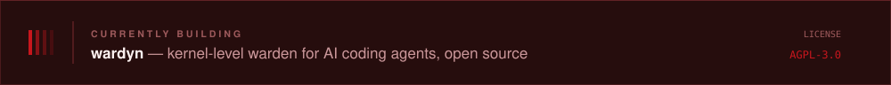

 

I build systems software in Rust — infrastructure that sits close to the kernel and the network, where security and privacy are design constraints rather than features bolted on afterwards.

Backend and systems engineer, studying Software Development at Anadolu University. My work sits where distributed systems, system-level security and AI infrastructure meet: middleware that has to stay up, peer-to-peer networks that have to stay reachable, and kernel-level enforcement that has to stay honest. I take on the backend bottlenecks other people route around.

 

A kernel-level warden for AI coding agents. eBPF LSM hooks and tracepoints watch every file, exec and socket the agent touches, and refuse the ones policy forbids before the syscall completes — no kernel module, no agent cooperation required.

**[wardyn](https://github.com/kadircanyildirm-crypto/wardyn)** · `Rust` · `AGPL-3.0` · open source

 

 

### Focus

**Runtime containment** — kernel-level wardens and sealed execution environments for autonomous AI agents, enforced below the process rather than negotiated with it.

**Verifiable privacy** — transparent L7 data-masking proxies and zero-knowledge proofs, so a result can be trusted without trusting the machine that produced it.

**Decentralised transport** — offline disaster-communication nodes and enterprise API gateways coordinated by gossip protocols and CRDTs, built to survive the network being wrong.

 

Rust for the parts that must not fail, Python and Go for the parts that must move quickly. Everything ships containerised and orchestrated — Docker and Kubernetes, minimal egress, fault tolerance assumed rather than added later. Working is the floor; deterministic and stable at the edge of the machine's capacity is the bar.

 

From explainable-AI middleware to UDP-based WAN file transfer, the through-line is the same: push the boundary where network optimisation meets machine learning, and keep latency and trust on the right side of it.

 

I'm open to systems and infrastructure work — Rust services, kernel and network-level tooling, distributed architecture, and security engineering. If you need help or know someone who does, I'd appreciate an introduction.

`kadir.can.yildirm@gmail.com`

 

